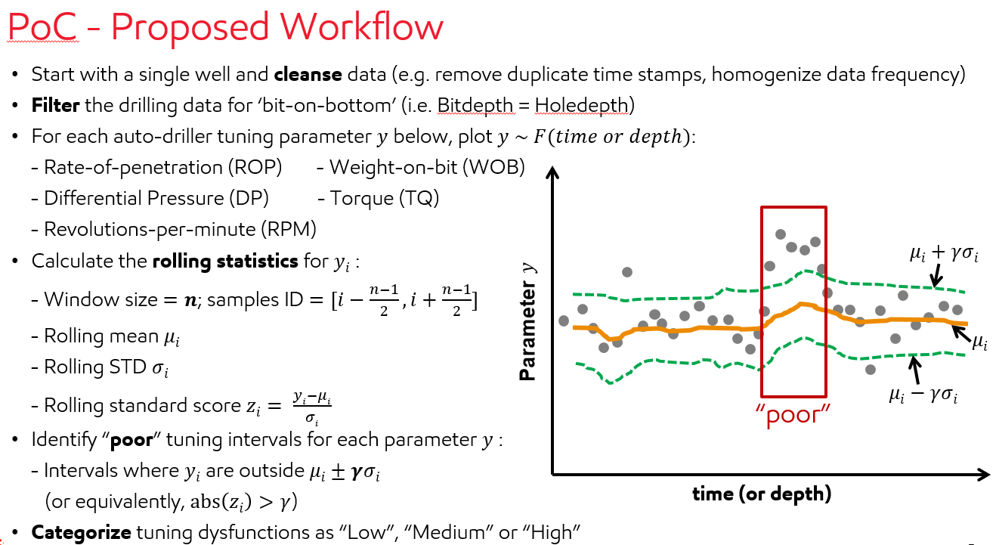

# Autodriller

goto/autodriller for background, history, and bi-weekly updates.

Contributors:
Liz Curry-Logan, UIS RTDD Data Science & Optimization
Xiao Ma, UIS RTDD Data Science & Optimization

## Structure
- src/
--  contains classes related to AutoDriller module
- notebooks/
--  contains notebooks from wells Databricks for POC
- utils/
-- contains some connection info for blob storage

## Proof-of-concept
A proof-of-concept was established using outlier detection based on simple statistics (essentially, a rolling average over a 30 second window of the interquartile range).

Sketch of POC algorithm to determin dysfunction level.
